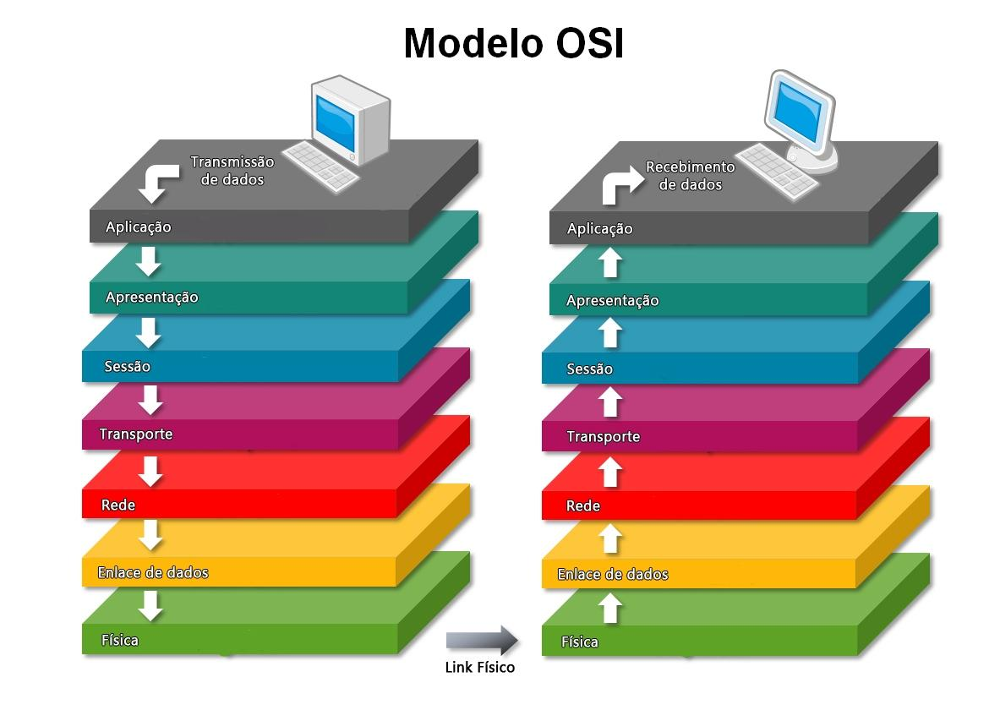

### Modelo OSI (Open Systems Interconnection)

O modelo OSI é uma estrutura de referência que define como diferentes sistemas de comunicação de rede devem interagir uns com os outros. Ele é dividido em sete camadas, cada uma com funções específicas. O objetivo principal do modelo é padronizar a comunicação entre diferentes sistemas de computação, promovendo a interoperabilidade e a compatibilidade entre fabricantes e tecnologias.

#### As Sete Camadas do Modelo OSI

1. **Camada Física (Layer 1)**

   - **Função:** Trata da transmissão bruta de dados em meios físicos. Essa camada lida com as características elétricas, ópticas, mecânicas e funcionais da conexão física.
   - **Exemplos:** Cabos de rede, hubs, conectores.

2. **Camada de Enlace de Dados (Layer 2)**

   - **Função:** Responsável pela transferência de dados entre dois dispositivos na mesma rede e pela detecção e correção de erros na camada física. Divide-se em duas subcamadas: Controle de Acesso ao Meio (MAC) e Controle de Enlace Lógico (LLC).
   - **Exemplos:** Switches, Bridges, MAC Address.

3. **Camada de Rede (Layer 3)**

   - **Função:** Gerencia o roteamento dos dados entre dispositivos em redes diferentes. A camada de rede decide qual caminho os dados devem seguir, dividindo-os em pacotes.
   - **Exemplos:** Roteadores, IP, ICMP.

4. **Camada de Transporte (Layer 4)**

   - **Função:** Garante que os dados sejam entregues sem erros, em sequência e sem duplicação. Fornece serviços como controle de fluxo, segmentação e remontagem, e controle de erro de ponta a ponta.
   - **Exemplos:** TCP, UDP.

5. **Camada de Sessão (Layer 5)**

   - **Função:** Gerencia as sessões de comunicação entre os dispositivos. A camada de sessão estabelece, mantém e encerra conexões entre os dispositivos.
   - **Exemplos:** Controle de sessões em RPC (Remote Procedure Call), sessões de login.

6. **Camada de Apresentação (Layer 6)**

   - **Função:** Tradução, criptografia e compressão de dados. A camada de apresentação garante que os dados sejam apresentados corretamente entre os dispositivos, independentemente dos padrões de codificação.
   - **Exemplos:** Criptografia SSL/TLS, tradução de formatos de dados.

7. **Camada de Aplicação (Layer 7)**
   - **Função:** Interface direta com o usuário final e fornece serviços de rede aos aplicativos. É a camada mais próxima do usuário, lidando com serviços como e-mail, navegação na web e transferência de arquivos.
   - **Exemplos:** HTTP, FTP, SMTP.

#### Diagrama do Modelo OSI

